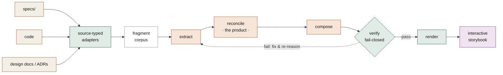
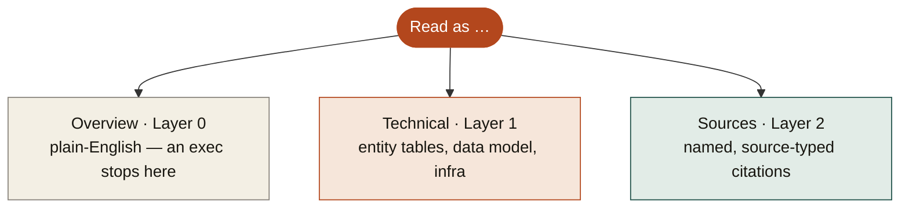

# spec-kit-synthesis

**Synthesize a project's scattered spec-kit specs into one readable, beautiful, interactive whole-system architecture document.** Where `/speckit.clarify` checks one spec for correctness and `/speckit.analyze` checks consistency, this reads *all* of them — overlapping, evolving, sometimes contradictory — and reasons them into a single current-state architecture storybook, organized by structure, not by spec history.

- **What it is:** a Claude Code plugin with two skills — `speckit-storybook` (one repo → one storybook) and `speckit-atlas` (a workspace of repos → a documentation portal). The in-session agent is the reasoning engine — no API key, no subprocess.
- **Output:** one self-contained, interactive HTML document — or a whole static portal of them
- **Toolchain:** [`uv`](https://docs.astral.sh/uv/) · Python ≥ 3.11
- **Status:** Phases 1–3 shipped, each judged faithful (0/0/0) by independent cross-model review
- **License:** MIT

A newcomer reads one generated document and understands how the whole system is built — accurately, in plain English, with every claim traceable to a source. Not a dashboard. Not a per-spec renderer. The *book*, not the filing cabinet.

---

## Why synthesis

A spec-driven project accretes dozens of small specs over time. No single document ever says "here is the whole system." New engineers and technical evaluators can't read 30 fragmented spec folders and reconstruct the architecture — and the specs *contradict* each other, because feature 003 supersedes a decision feature 001 made. Existing tooling can't help here:

| Need | `/speckit.clarify` | `/speckit.analyze` | Synthesis |
|---|---|---|---|
| Is one spec internally correct? | ✅ | partial | — |
| Are the specs mutually consistent? | ❌ | ✅ | — |
| What does the **whole system** look like, now? | ❌ | ❌ | ✅ |
| Which superseded decisions are no longer true? | ❌ | ❌ | ✅ |
| Where do the specs leave a gap? | partial | partial | ✅ |
| Is the spec actually **built** (intent vs code)? | ❌ | ❌ | ✅ |

Synthesis is a *reasoning* task — reconciling many sources into one current-state narrative — which is why an LLM does it and a template cannot.

## How it works



1. **Adapt (code).** A source adapter turns each input into a *source-typed fragment corpus* — `spec` fragments from spec folders, `code` fragments from a source tree, `design_doc` fragments from ADRs/design docs. The core never learns what a "spec" is; it reasons over uniform fragments. This is the seam that lets new sources drop in without a rewrite.
2. **Extract → reconcile → compose (the in-session agent).** The agent reads the corpus and reasons the three phases: pull each source's claims/decisions/open-questions; **reconcile** them into one current-state model — merging overlaps, demoting superseded behaviour to *evolution notes*, surfacing contradictions as *open questions*; then compose altitude-tagged prose, callouts, and declarative diagrams. Reconcile is the product; everything else serves it.
3. **Verify (code, fail-closed).** A deterministic gate rejects any claim whose provenance doesn't resolve, any ungrounded block, any empty callout, or a missing scope note. Faithfulness is *code-enforced*, not model-promised — if the gate exits non-zero, the run isn't done.
4. **Render (code).** A deterministic renderer turns the document model into one self-contained, interactive SVG storybook (theme-aware, no external assets).

## What it produces

A single HTML file you can read at **three depths** via one control — so an executive and a developer read the same document:



Plus: hand-laid **SVG diagrams** with per-layout animation (pipeline · flow · ladder · mapping · panel · hub · stack · timeline), per-section disclosure for technical depth, a scrollspy table of contents, three callout types (**decision** · **evolution** · **unspecified**), and — when a code source is supplied — a **coverage view** that cross-checks the specified architecture against the actual code. Every citation chip **drills into the actual cited spec/ADR** — each source file is rendered as a beautified, self-contained page under `sources/` (across all related repos, content *copied into the HTML*).

> **See it for real.** Two generated artifacts live in [`examples/generated/`](examples/generated/) — a full architecture storybook and a coverage storybook, both produced by this tool from a real three-feature project, plus [`RESULT.md`](examples/generated/RESULT.md) recording the faithfulness review. The hand-written north-star target is [`examples/speckit-linear-architecture.html`](examples/speckit-linear-architecture.html). The current renderer — the editorial design system (spec [`001-renderer-v2`](specs/001-renderer-v2/)) — is shown by [`renderer-v2-sample.html`](examples/generated/renderer-v2-sample.html); open it, expand a section's *Technical detail*, then scroll to watch each diagram animate.

## Install

This is a Claude Code **plugin** (`.claude-plugin/plugin.json`) bundling two skills — `speckit-storybook` and `speckit-atlas`. Install it so the skills are namespaced as `/spec-kit-synthesis:speckit-storybook` and `/spec-kit-synthesis:speckit-atlas`:

```bash
git clone https://github.com/ashbrener/spec-kit-synthesis.git
# then add it as a plugin from a local marketplace, or symlink it under your plugins dir
```

The skills reference their deterministic scripts via `${CLAUDE_PLUGIN_ROOT}`, so as an installed plugin run them against the plugin's own project — `uv run --project "${CLAUDE_PLUGIN_ROOT}" python "${CLAUDE_PLUGIN_ROOT}/skill/scripts/<script>.py" …`. `uv` builds the environment on first run (only `pydantic`); no manual setup.

For in-repo development (the script paths below drop the `${CLAUDE_PLUGIN_ROOT}` prefix):

```bash
cd spec-kit-synthesis
uv run pytest skill/tests -q     # confirm the toolchain
```

## Usage

One command drives the whole pipeline. Run it once to adapt the sources and get the agent's hand-off brief; the in-session agent then reasons the architecture (citing only the emitted locator list); re-run with `--out` to verify and render.

```bash
# 1. Specs only → architecture storybook
uv run python skill/scripts/synthesize.py path/to/specs \
    --work .synthesis --project-name "My System"
#    … the in-session agent reasons .synthesis/architecture_model.json
#      + document_model.json, citing only .synthesis/locators.txt …
uv run python skill/scripts/synthesize.py path/to/specs \
    --work .synthesis --out architecture.html

# 2. Specs + code → adds the coverage view (specified vs built)
uv run python skill/scripts/synthesize.py path/to/specs --code path/to/src \
    --work .synthesis --out architecture.html

# 3. Add free-form design docs / ADRs as a third source
uv run python skill/scripts/synthesize.py path/to/specs \
    --code path/to/src --docs path/to/docs --work .synthesis --out architecture.html
```

### Match a host project's look (optional)

```bash
# Detect a project's design tokens (CSS custom properties / Tailwind) → a theme,
# then theme the storybook with it. Fail-soft: unknown tokens keep the defaults.
uv run python skill/scripts/theme_detect.py path/to/project --out synthesis.theme.json
uv run python skill/scripts/synthesize.py path/to/specs \
    --work .synthesis --out architecture.html --theme synthesis.theme.json
```

The individual stages are also runnable directly (`adapter_speckit.py`, `adapter_code.py`, `adapter_doc.py`, `verify.py`, `render.py`); `synthesize.py` orchestrates them.

## Many repos → one portal (`speckit-atlas`)

When the story spans repositories — a docs repo, the spec-kit specs behind it, the backend/frontend that implement it — the `speckit-atlas` skill federates them into one static documentation portal: **a faithful plain-English storybook per repo, plus a verified `docs↔specs↔code` traceability atlas.** Each page is built by the exact same engine as a single repo; the portal layer (index + atlas + cross-repo links) is purely additive and never touches per-page reasoning.

You describe the workspace in a `synthesis.workspace.json` next to the repos, then run the portal front door twice (adapt → the agent reasons each member → verify + render):

```bash
# 1. Adapt every member, get the per-member hand-off brief
uv run python skill/scripts/synthesize_atlas.py synthesis.workspace.json --work .synthesis-portal
#    … the in-session agent reasons each member's architecture_model + document_model
#      into .synthesis-portal/<origin>/, using only that member's locators …
# 2. Verify cross-repo links (fail-closed) + render the whole site
uv run python skill/scripts/synthesize_atlas.py synthesis.workspace.json \
    --work .synthesis-portal --out site/
```

The result in `site/` is self-contained — `index.html` (book-of-books), one page per repo, and `atlas.html` (the verified graph). Host it on Netlify/Vercel or open `index.html` directly; no checkout, no auth, no server. Repos that aren't checked out can be marked `"optional": true` (skipped with a warning, coverage-honest) or carry a `url`+`pin` to be fetched. Cross-repo links are **fail-closed**: an edge ships only with real evidence (declared in the manifest, a shared qualified identifier, or a literal prose quote), gated by `verify_links.py`. See [`skills/speckit-atlas/SKILL.md`](skills/speckit-atlas/SKILL.md) for the manifest format and the full algorithm.

**Governed projects get a richer read (ungoverned projects are unchanged).** When a project adopts the architecture-governance convention, atlas conforms to its published contracts *as a documented format* — no runtime dependency, read-only on the consumer repos. It renders **typed citations** matching the shared vocabulary (`cites` for a plan→decision, `implements` for code→spec, `derived_from` for spec→spec, `references` as the untyped fallback), reads **bare `ADR-NNN`** decisions under each repo's configured namespace (`<namespace>-ADR-NNN`, no file renames; bare ids stay repo-local), trusts a declared **`.spec-arch-domain.yml`** as the source-of-truth topology (members/roles/namespaces/locators, graded `declared`) with `synthesis.workspace.json` as the presentation overlay + fallback, and grades every cross-repo fact by **evidence tier** (`declared` > `identifier` > `prose`). The vendored contracts under `skill/scripts/vendor/` are drift-guarded in CI. A project that declares none of this produces byte-identical output to before.

## The hard-and-fast rule: faithful, or it doesn't ship

*A confident, wrong architecture document is worse than none.* Faithfulness is an architectural invariant, enforced two ways:

- **Code-enforced (`verify.py`).** Every claim carries ≥1 source reference that must resolve to a real fragment; a sentence resting on no source cannot be written. Where the specs leave a question open, the document says **"Unspecified"** — it never invents an answer. Where the specs *contradict each other*, it surfaces the disagreement rather than silently picking a side. The gate fails closed.
- **Generated, never authored.** The storybook is a *read* surface, regenerated from the sources — never hand-edited. To fix a claim, you fix the *source* and regenerate. This is what keeps it from rotting into a competing source of truth.

These aren't aspirations. In the reference runs, an adversarial cross-model reviewer (Codex) iterated each generated document to a **faithful 0/0/0** verdict, and along the way the gate itself was hardened in code so whole classes of error can't recur. See [`examples/generated/RESULT.md`](examples/generated/RESULT.md).

## Multiple sources, one document

The core is source-agnostic, so the same engine consumes more than spec folders:

| Source | Adapter | Fragment type | Adds |
|---|---|---|---|
| spec-kit folders | `adapter_speckit.py` | `spec` | the functional + technical narrative |
| a source tree | `adapter_code.py` | `code` | the **coverage view** (intent vs reality) |
| design docs / ADRs | `adapter_doc.py` | `design_doc` | rationale the specs may omit |

All merge into one collision-checked corpus. Citations are **source-typed**, so a reader can tell whether a claim rests on a spec, a design doc, or the code itself.

## How it's organized

```
.claude-plugin/
  plugin.json               the plugin manifest (name, two skills, scripts)
skills/
  speckit-storybook/SKILL.md  one repo → one storybook (the page engine + its algorithm)
  speckit-atlas/SKILL.md      a workspace of repos → a documentation portal (the SITE layer)
skill/
  scripts/                  shared deterministic engine (both skills call these)
    schema.py               the IR contracts (source-typed provenance, altitudes, coverage, links)
    adapter_speckit.py      spec folders   → fragment corpus
    adapter_code.py         a source tree  → fragment corpus  (coverage)
    adapter_doc.py          design docs/ADRs → fragment corpus
    verify.py               fail-closed faithfulness gate (per page)
    render.py               document model + theme → interactive SVG HTML
    theme_detect.py         host CSS/Tailwind tokens → a theme
    synthesize.py           the one-command front door (single repo)
    synthesize_atlas.py     the portal front door (workspace → site)
    discover_links.py       declared + shared-identifier + cites cross-repo edges
    gov_config.py           reads governed .spec-arch-governance.yml / .spec-arch-domain.yml
    verify_links.py         fail-closed cross-repo link gate
  tests/                    the test suite (uv run pytest skill/tests -q)
examples/                   the north-star target + generated results
DESIGN.md                   the full design rationale — read §11 for the resolved architecture
```

## Continuous integration

CI (GitHub Actions, [`.github/workflows/ci.yml`](.github/workflows/ci.yml)) runs the suite on Python 3.11 and 3.12 for every push and pull request. Run the exact CI command locally before pushing:

```bash
uv run pytest skill/tests -q
```

## Troubleshooting

### `verify: FAIL — … VIOLATION(S)`
The gate is doing its job. Each line names the check and the offending claim/block/locator. Common causes: a claim cites a `locator` not in the corpus (fix the citation to a real fragment id from `.synthesis/locators.txt`), a prose block with no `claim_ids` (ground it), or an empty callout (give it a body). Never edit `verify.py` to pass — fix the model.

### The narrative mentions a spec number / FR code
The body must read "here's the system," never "spec 003 says…". Source identifiers belong only in the Layer-2 citation chips. Move the number out of the prose; keep it in the claim's `source_refs`.

### `synthesize: locator collision merging <code|design-doc> corpus`
Two sources produced the same fragment id (rare). The adapters use disjoint id schemes by design; report it — it indicates a fixture with an unusual path shape.

### Coverage omits a file that exists in the code
That's the failure mode the coverage view exists to prevent (a partial map that looks complete). Every scanned code file should appear in the coverage table; add the missing area, classified honestly.

### A detected theme looks subtly wrong
Theme detection is conservative and fail-soft, but fuzzy by nature. It prints low-confidence mappings as warnings — review them, or drop `--theme` to use the default reference theme, which is always correct.

## Related work

Part of an ecosystem of spec-kit tools built around a shared discipline — *local source of truth → human-facing surface, unidirectional, faithful*:

- **[spec-kit-linear](https://github.com/ashbrener/spec-kit-linear)** — mirrors specs into Linear as trackable issues.
- **spec-kit-red-team** — adversarial review of specs before architecture locks in.

Where the trackers *project* spec state into a tool, synthesis *reverse-engineers* the coherent whole-system story from the scattered sources.

## License

MIT.
