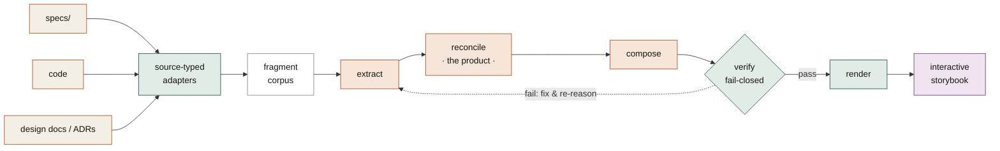
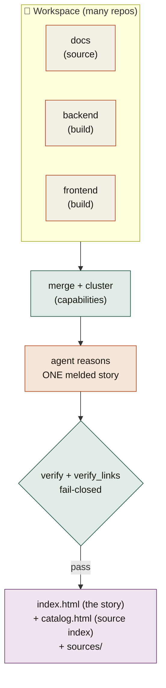
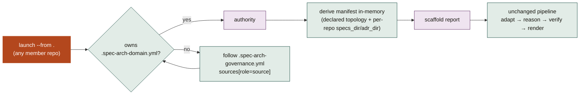

# Atlas — a Spec Kit extension

**Turn a project's scattered spec-kit specs into one readable, beautiful, interactive whole-system
architecture document — accurate, in plain English, with every claim traceable to its source.**
Where `/speckit.clarify` checks one spec for correctness and `/speckit.analyze` checks consistency,
atlas reads *all* of them — overlapping, evolving, sometimes contradictory — and reasons them
into a single **current-state** architecture storybook, organized by structure, not by spec history.
A newcomer reads one generated document and understands how the whole system is built. The *book*,
not the filing cabinet.

- **Version:** 0.1.0
- **Repository:** <https://github.com/ashbrener/spec-kit-atlas>
- **License:** MIT
- **Requires:** Spec Kit ≥ 0.1.0 · [`uv`](https://docs.astral.sh/uv/) · Python ≥ 3.11 (the only deps are `pydantic` + `pyyaml`)
- **Commands:** `/speckit.atlas.storybook` (one repo → one storybook) · `/speckit.atlas.map` (a workspace of repos → a documentation portal + verified traceability atlas)
- **Reasoning engine:** the in-session agent — no API key, no subprocess, no model server

> The in-session agent does the reasoning; deterministic Python scripts carry parsing, the
> **fail-closed faithfulness gate**, and rendering. Atlas is **read-only** on your sources and
> introduces **no runtime dependency** on any other extension.

## Why atlas

A spec-driven project accretes dozens of small specs over time. No single document ever says "here
is the whole system." New engineers and technical evaluators can't read 30 fragmented spec folders
and reconstruct the architecture — and the specs *contradict* each other, because feature 003
supersedes a decision feature 001 made. Existing tooling can't help here:

| Need | `/speckit.clarify` | `/speckit.analyze` | Atlas |
|---|---|---|---|
| Is one spec internally correct? | ✅ | partial | — |
| Are the specs mutually consistent? | ❌ | ✅ | — |
| What does the **whole system** look like, now? | ❌ | ❌ | ✅ |
| Which superseded decisions are no longer true? | ❌ | ❌ | ✅ |
| Where do the specs leave a gap? | partial | partial | ✅ |
| Is the spec actually **built** (intent vs code)? | ❌ | ❌ | ✅ |

Atlas is a *reasoning* task — reconciling many sources into one current-state narrative — which
is why an LLM does it and a template cannot. What keeps it trustworthy is that the model proposes and
a deterministic, fail-closed gate disposes.

## How it works



1. **Adapt (code).** A source adapter turns each input into a *source-typed fragment corpus* — `spec`
   fragments from spec folders, `code` fragments from a source tree, `design_doc`/`adr` fragments
   from design docs and ADRs. The core never learns what a "spec" is; it reasons over uniform
   fragments. This seam lets new sources drop in without a rewrite.
2. **Extract → reconcile → compose (the in-session agent).** The agent reads the corpus and reasons
   the three phases: pull each source's claims/decisions/open-questions; **reconcile** them into one
   current-state model — merging overlaps, demoting superseded behaviour to *evolution notes*,
   surfacing contradictions as *open questions*; then compose altitude-tagged prose, callouts, and
   declarative diagrams. Reconcile is the product; everything else serves it.
3. **Verify (code, fail-closed).** A deterministic gate rejects any claim whose provenance doesn't
   resolve, any ungrounded block, any empty callout, or a missing scope note. Faithfulness is
   *code-enforced*, not model-promised — if the gate exits non-zero, the run isn't done.
4. **Render (code).** A deterministic renderer turns the document model into one self-contained,
   interactive HTML storybook (editorial design system, animated SVG diagrams, no external assets).

## What it produces

A single HTML file readable at **three depths**, so an executive and a developer read the same
document:


Plus: hand-laid **SVG diagrams** with per-layout animation (pipeline · flow · ladder · mapping ·
panel · hub · stack · timeline), per-section disclosure for technical depth, a scrollspy table of
contents, three callout types (**decision** · **evolution** · **unspecified**), and — when a code
source is supplied — a **coverage view** that cross-checks the specified architecture against the
actual code. Every citation chip **drills into the actual cited spec/ADR/code** — each source file is
rendered as a beautified, self-contained page under `sources/` (across all related repos, content
*copied into the HTML*).

> **See it for real.** Generated artifacts live in [`examples/generated/`](examples/generated/) — a
> full architecture storybook and a coverage storybook produced by this tool from a real
> three-feature project, plus [`RESULT.md`](examples/generated/RESULT.md) recording the faithfulness
> review. The hand-written north-star target is
> [`examples/speckit-linear-architecture.html`](examples/speckit-linear-architecture.html).

## Install

Atlas is a **spec-kit extension**, installed with the `specify` CLI into any spec-kit project.

```bash
# from the spec-kit community catalog (once published):
specify extension add atlas

# …or from this GitHub repo directly:
specify extension add --from https://github.com/ashbrener/spec-kit-atlas/archive/refs/tags/v0.1.0.zip

# …or from a local checkout (dogfood / development):
specify extension add /path/to/spec-kit-atlas --dev
```

Installing copies the extension into your project's `.specify/extensions/atlas/` and registers
two commands; if your project was initialised with Claude skills, the CLI also generates
`/speckit.atlas.storybook` and `/speckit.atlas.map` under `.claude/skills/`. The extension
declares **no lifecycle hooks** — it runs only when you invoke it.

> **Add `.specify/extensions/atlas/` to your project's `.gitignore`.** The vendored extension is
> regenerable (re-run `specify extension add`) and a `--dev` copy carries a nested `.git` and `.venv`
> you do not want to commit.

## Usage

### One repo → a storybook (`/speckit.atlas.storybook`)

Invoke the command and point it at your `specs/` (optionally a source tree for the coverage view, and
design docs/ADRs). The agent reasons the architecture, the gate verifies it, and the renderer emits
one HTML file. Under the hood it runs the deterministic stages — locate the extension root once, then
run scripts with their deps provided ephemerally (this ignores any stale vendored `.venv`):

```bash
SYN=.specify/extensions/atlas          # or "." when developing inside this repo

# 1. adapt + the agent's hand-off brief (it then reasons the IR, citing only the emitted locators)
uv run --with pydantic --with pyyaml python "$SYN/skill/scripts/synthesize.py" path/to/specs \
    --work .atlas --project-name "My System"

# 2. verify + render (add --code path/to/src for the coverage view; --docs / --adr-dir for ADRs)
uv run --with pydantic --with pyyaml python "$SYN/skill/scripts/synthesize.py" path/to/specs \
    --work .atlas --out architecture.html
```

### Many repos → one portal (`/speckit.atlas.map`)

When the story spans repositories — a docs repo, the spec-kit specs behind it, the backend/frontend
that implement it — atlas weaves them into **ONE melded, capability-organized story**. Sections are
capabilities (e.g. "Authentication"), each woven across the tiers: a plain-English functional
narrative from the source layer, then per-tier technical detail (backend, frontend), every claim
drilling to its own repo. Built work renders solid; planned faded. The spine is a deterministic
clustering over the verified cross-repo link graph (no external graph dependency).



```bash
SYN=.specify/extensions/atlas
# 1. adapt + merge + cluster → the capability spine + hand-off brief (agent reasons ONE melded story)
uv run --with pydantic --with pyyaml python "$SYN/skill/scripts/synthesize_atlas.py" \
    --from . --work .atlas-portal
# 2. verify (links + meld) fail-closed + render the single melded page + source index + sources
uv run --with pydantic --with pyyaml python "$SYN/skill/scripts/synthesize_atlas.py" \
    --from . --work .atlas-portal --out site/
```

`site/` is self-contained — `index.html` (the melded story), `catalog.html` (the hierarchical source
index: repo › feature › artifacts), and `sources/` (drill-to-source). Cross-repo links and every
claim are **fail-closed**: nothing ships without real, resolving evidence. See
[`commands/map.md`](commands/map.md) for the full algorithm.

### Governed workspaces: one command, no manifest

On a **governed** workspace (one adopting the architecture-governance convention), you don't author a
manifest at all. Invoke atlas with **no manifest** and a `--from` pointing anywhere inside the
workspace; atlas discovers the authority, derives the manifest in-memory, and runs the pipeline:



```bash
SYN=.specify/extensions/atlas
uv run --with pydantic --with pyyaml python "$SYN/skill/scripts/synthesize_atlas.py" \
    --from . --work .atlas-portal          # then re-run with --out site/ after reasoning
```

No manifest file is written (it's carried in-memory; the reader stays read-only on consumer repos). A
partial `atlas.workspace.json` passed alongside overlays presentation and may add/override
members (e.g. enabling a build repo's code). An **ungoverned** workspace still needs a hand-authored
manifest — nothing is invented.

## The hard-and-fast rule: faithful, or it doesn't ship

*A confident, wrong architecture document is worse than none.* Faithfulness is an architectural
invariant, enforced two ways:

- **Code-enforced (`verify.py` / `verify_links.py`).** Every claim carries ≥1 source reference that
  must resolve to a real fragment; a sentence resting on no source cannot be written. Where the specs
  leave a question open, the document says **"Unspecified"**; where they *contradict*, it surfaces the
  disagreement rather than silently picking a side. Cross-repo edges need real evidence. The gates
  fail closed — never edit them to pass.
- **Generated, never authored.** The storybook is a *read* surface, regenerated from the sources —
  never hand-edited. To fix a claim, fix the *source* and regenerate. That keeps it from rotting into
  a competing source of truth.

In the reference runs, an adversarial cross-model reviewer iterated each generated document to a
**faithful 0/0/0** verdict. See [`examples/generated/RESULT.md`](examples/generated/RESULT.md).

## Configuration

Atlas needs **no configuration file** — install and invoke. Two optional inputs tune it:

- **Theme (optional).** Match a host project's look: `theme_detect.py` reads a project's CSS custom
  properties / Tailwind tokens into a theme JSON, which you pass via `--theme`. Fail-soft: unknown
  tokens keep the defaults.
- **Governed reading (automatic).** When a project adopts the
  [spec-kit-arch-governance](https://github.com/ashbrener/spec-kit-arch-governance) convention, atlas
  reads its published contracts *as a documented format* (no runtime dependency, read-only): a
  declared **`.spec-arch-domain.yml`** is the source-of-truth topology (members/roles/namespaces/
  locators, graded `declared`); **declared citation slots** are read directly from front-matter
  (`derived_from: [<source>:<feature>]` in `spec.md`, `cites: [<NS>-ADR-NNN]` in `plan.md` —
  vocabulary.json@0.3.0), so a build spec melds with its source feature from the *declaration*, not
  from prose coincidence; **typed citations** match the shared vocabulary (`cites` for a
  plan→decision, `implements` for code→spec, `derived_from` for spec→spec, `references` otherwise);
  bare **`ADR-NNN`** reads under each repo's namespace (`<namespace>-ADR-NNN`, no renames; bare ids
  stay repo-local); every cross-repo fact is graded by **evidence tier** (`declared` > `identifier` >
  `prose`). The vendored contracts under `skill/scripts/vendor/` are drift-guarded in CI. An
  ungoverned project produces byte-identical output to before — these reads are purely additive.

### Multiple sources, one document

The core is source-agnostic, so the same engine consumes more than spec folders:

| Source | Adapter | Fragment type | Adds |
|---|---|---|---|
| spec-kit folders | `adapter_speckit.py` | `spec` | the functional + technical narrative |
| a source tree | `adapter_code.py` | `code` | the **coverage view** (intent vs reality) |
| design docs / ADRs | `adapter_doc.py` | `design-doc` / `adr` | rationale the specs may omit |

All merge into one collision-checked corpus. Citations are **source-typed**, so a reader can tell
whether a claim rests on a spec, a design doc, an ADR, or the code itself.

## How it's organized

```
extension.yml               the spec-kit extension manifest (specify extension add reads this)
commands/
  storybook.md              /speckit.atlas.storybook — one repo → one storybook (the page engine)
  map.md                  /speckit.atlas.map — a workspace → a portal (the SITE layer)
skill/
  scripts/                  shared deterministic engine (both commands call these)
    schema.py               the IR contracts (source-typed provenance, altitudes, coverage, links)
    adapter_speckit.py      spec folders     → fragment corpus
    adapter_code.py         a source tree    → fragment corpus  (coverage)
    adapter_doc.py          design docs/ADRs → fragment corpus
    verify.py               fail-closed faithfulness gate (per page)
    render.py               document model + theme → interactive SVG HTML
    render_sources.py       cited source files → bundled drill-to-source pages
    theme_detect.py         host CSS/Tailwind tokens → a theme
    synthesize.py           the one-command front door (single repo)
    synthesize_atlas.py     the portal front door (workspace → site)
    scaffold.py             governed auto-scaffold: discover authority → derive manifest
    discover_links.py       declared + shared-identifier + cites cross-repo edges
    gov_config.py           reads governed .spec-arch-governance.yml / .spec-arch-domain.yml
    verify_links.py         fail-closed cross-repo link gate
    vendor/                 pinned governance contracts (drift-guarded)
  tests/                    the test suite (uv run pytest skill/tests -q)
examples/                   the north-star target + generated results
specs/                      this extension's own spec-kit specs (it is self-hosted)
DESIGN.md                   the full design rationale — read §11 for the resolved architecture
```

## Continuous integration

CI (GitHub Actions, [`.github/workflows/ci.yml`](.github/workflows/ci.yml)) runs the suite on Python
3.11 and 3.12 for every push and pull request, including the extension-manifest contract test and the
governance-contract drift guard. Run the exact CI command locally before pushing:

```bash
uv run pytest skill/tests -q
```

## Troubleshooting

### `verify: FAIL — … VIOLATION(S)`
The gate is doing its job. Each line names the check and the offending claim/block/locator. Common
causes: a claim cites a `locator` not in the corpus (fix it to a real fragment id from
`.atlas/locators.txt`), a prose block with no `claim_ids` (ground it), or an empty callout. Never
edit the gate to pass — fix the model.

### `Library not loaded: …libpython…` when running a vendored script
A `--dev` install copies the source repo's `.venv`, whose paths are broken in the new location. Run
scripts with `uv run --with pydantic --with pyyaml python …` (as shown above) — it builds a correct
ephemeral environment and ignores the stale venv. (A catalog/archive install does not carry a `.venv`.)

### The narrative mentions a spec number / FR code
The body must read "here's the system," never "spec 003 says…". Source identifiers belong only in the
Layer-2 citation chips. Move the number out of the prose; keep it in the claim's `source_refs`.

### `synthesize: locator collision merging <code|design-doc> corpus`
Two sources produced the same fragment id (rare). The adapters use disjoint id schemes by design;
report it — it indicates a fixture with an unusual path shape.

### A detected theme looks subtly wrong
Theme detection is conservative and fail-soft but fuzzy by nature. It prints low-confidence mappings
as warnings — review them, or drop `--theme` to use the default reference theme, which is always
correct.

## Contributing

Atlas is itself a spec-kit project — it self-hosts the workflow and is built through
`specify → clarify → plan → tasks → implement` (see `specs/`). To contribute:

1. Branch off `main`; never commit to `main` directly.
2. Keep the toolchain `uv` (never `pip`), Python ≥ 3.11.
3. `uv run pytest skill/tests -q` must be green before any PR (it is the CI gate).
4. Never weaken the faithfulness gates (`verify.py` / `verify_links.py`) to make a run pass.
5. Open a PR; CI runs on 3.11 and 3.12.

Bug reports and feature requests are welcome via GitHub issues.

## Related work

Part of an ecosystem of spec-kit tools built around a shared discipline — *local source of truth →
human-facing surface, unidirectional, faithful*:

- **[spec-kit-arch-governance](https://github.com/ashbrener/spec-kit-arch-governance)** — keeps
  specs↔code↔ADRs in sync (born-compliant citation slots + a read-only validator) and owns the shared
  vocabulary atlas reads.
- **[spec-kit-linear-sync](https://github.com/ashbrener/spec-kit-linear-sync)** — mirrors specs into
  Linear as trackable issues.
- **[spec-kit-jira-sync](https://github.com/ashbrener/spec-kit-jira-sync)** — the same bridge for Jira.
- **[spec-kit-red-team](https://github.com/ashbrener/spec-kit-red-team)** — adversarial review of
  specs before architecture locks in.

Where the trackers *project* spec state into a tool, and governance *enforces* sync, atlas
*reverse-engineers* the coherent whole-system story from the scattered sources.

## License

MIT — see [LICENSE](LICENSE).
